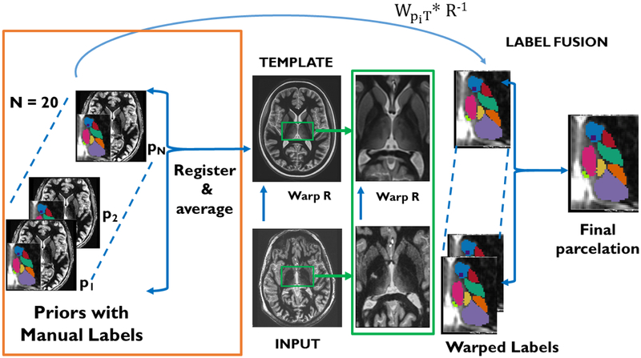

# THOMAS: Thalamus-Optimized Multi-Atlas Segmentation (v 2.1)
Code for segmentation of the thalamus into 12 nuclei using multi-atlas segmentation and PICSL's joint label fusion. Note that this version supports the much faster cropped FOV version (called ST THOMAS in ISMRM abstracts) and the slower original full FOV (THOMAS) using v2 and v0 arguments for -a respectively. 

**NOTE: This version is mainly for segmentation of WMn MPRAGE (FGATIR) data. For T1 data, please use HIPSTHOMAS here  https://github.com/thalamicseg/hipsthomasdocker
This version supports both image contrasts.**


THOMAS workflow is shown below-



## New features

**5/13/2021- HIPS THOMAS**
Click here for a THOMAS version that supports T1 and WMn https://github.com/thalamicseg/hipsthomasdocker
We highly recommend using this for most users

**8/3/2021- Docker container support**
Click here for a version tested on Linux box only https://github.com/thalamicseg/thomasdocker

**3/12/2021- Patch added to support python 3 (finally !)**

Release date 12/9/2020.

Compared to 2.0, this version has improved scripts for conventional T1 MPRAGE processing (uses MI and large crops by default).
It also includes a new mask and a new cropped template for a new -B option which is recommended for cases with enlarged ventricles (e.g. AD)
To use this option, use _thomas_csh_big_ script. The -B flag is already added in _thomas_csh_mv_ by default. 

Compared to 1.0, this version  

a. supports  conventional T1 MPRAGE processing (see Usage below)

b. supports  Mac installatios (automatic detection,  PICSL-MALF not required)

c. creates left and right directories for output (bilateral processing is default, see Outputs below) and creates full sized fused labels

## Requirements
- [ANTs](https://github.com/ANTsX/ANTs/releases)
- [FSL](http://fsl.fmrib.ox.ac.uk/fsl/fslwiki/FslInstallation)
- [convert3d](http://www.itksnap.org/pmwiki/pmwiki.php?n=Downloads.C3D)
- [PICSL-MALF](https://www.nitrc.org/frs/?group_id=634) (see important note below)
- python 2 or 3 (see last point of Installation instructions regarding python3)
 
Note: you might have to install ITK from scratch to make PICSL-MALF work esp running on CentOS. Ubuntu seems to work fine. MAC users with Mint Linux can use  https://github.com/dzenanz/PICSL_MALF.git for PICSL-MALF and this is compatible with newer ITK versions (e.g. 5.1). If it still fails in jointfusion, edit thomas_csh to remove the --jointfusion option in the three locations and retry. This will force the use of antsJointFusion which is slower but works if ANTS is installed.

## Installation instructions 
- VERY IMPORTANT PLEASE READ **Git**: due to large files in the thomas repository, you will need to install git-lfs first. You can do this using ```sudo apt-get install git-lfs```. If this fails, try running ```curl -s https://packagecloud.io/install/repositories/github/git-lfs/script.deb.sh | sudo bash``` first and then ```sudo apt-get install git-lfs```. If git-lfs is not installed, you will only get soft links and not the actual files. Please email manojsar@email.arizona.edu if you have any issues
- Once git-lfs is installed successfully, you can download thomas using ```git lfs clone https://github.com/thalamicseg/thomas_new.git```
- After you install, go to thomas_new and do a ```ls -l``` and make sure originaltemplate is a huge file. If it is only a few bytes, git lfs was not installed properly.
- Make sure you have added the paths to ANTS, FSL, THOMAS, jointfusion and c3d (which is wherever you installed PICSL-MALF and convert3d)- this is usually done by adding to PATH in .cshrc or .bashrc
- Set an environment variable THOMAS_HOME in .cshrc or .bashrc to where you install thomas (e.g. ~/thomas_new). If you are not familiar with .cshrc, you can hardwire it in thomas_csh and thomas_csh_mv with the line setenv THOMAS_HOME ~/thomas_new (or wherever you install)
- **Python**: run ```python require.py```  To use python3, first do a git lfs clone of thomas_new as described above. You should see a p3.tgz in thomas_new. Extract it there using ```tar -xvzf p3.tgz``` and it will replace all the python2 .py files by the new python3 versions. 
## Usage
	
- Use the thomas_csh wrapper provided for WMn MPRAGE or FGATIR data (or thomas_csh_big for handling large ventricles such as in older subjects)
  
  Usage: ```thomas_csh WMnMPRAGE_file <ro/lo>```  or ```thomas_csh_big WMnMPRAGE_file <ro/lo> ```

  Note 1: the first argument is the white matter nulled MPRAGE or FGATIR file in NIFTy nii.gz format. Make sure it is just the file name and not a full path (e.g. wmn.nii.gz not ~foo/data/case1/wmn.nii.gz. Basically, run the script in the directory where the file is located. If you have each subject in a directory, go to each directory and call the thomas_csh script, usually from a simple csh or bash script
    
  Note 2: the second argument if set to ro/lo would only segment the right/left side (if missing, it defaults to both left and right)
- Use the thomas_csh_mv wrapper provided for standard MPRAGE or T1 (FSPGR or BRAVO in older GE) data

  Usage: ```thomas_csh_mv MPRAGEorT1_file <ro/lo>``` 
  
- For full usage of THOMAS, type ```python THOMAS.py -h```
- Example: ```python THOMAS.py -a v2 -p 4 -v --jointfusion --tempdir temp wmnmpragefilename ALL```
	- tempdir is often useful in case something goes wrong, you can resume from previous attempts. Delete this directory if you want to rerun the full segmentation or it will just use the warps from here.

-
 
## Outputs
The directories named **left** and **right** contain the outputs which are individual labels (e.g. 2-AV.nii.gz for anteroventral and so on), **thomas.nii.gz** which is a single file with all labels fused and **thomasfull.nii.gz** which is the same size as the input file (i.e. full size as opposed to thomas which is cropped). In addition, **nucVols.txt** contains the nuclei volumes. **regn.nii.gz** is the custom template registered to the input image. This file is critical for debugging. Make sure this file and crop_inputfilename are well aligned. Note that this is for left side. The right regn.nii.gz needs to be swapped LR before it will align to crop_inputfilename. A color table file called **CustomAtlas.ctbl** is provided for visualization. temp and tempr are for advanced debugging and can be deleted to save space (e.g. add a line at the end of thomas_csh)

## Thalamic nuclei expansions and label definitions
THOMAS outputs the mammillothalamic tract (14-MTT) and the eleven delineated nuclei grouped as follows (__Note that 6-VLP is further split into 6_VLPv and 6_VLPd. 6_VLPv is the same as VIM used for targeting in DBS applications__)-

	(a) medial group: habenula (13-Hb), mediodorsal (12-MD), centromedian (11-CM) 
	(b) posterior group: medial geniculate nucleus (10-MGN), lateral geniculate nucleus (9-LGN),  pulvinar (8-Pul),
	(c) lateral group: ventral posterolateral (7-VPL), ventral lateral posterior (6-VLp), ventral lateral anterior (5-VLa), ventral anterior nucleus (4-VA)
	(d) anterior group: anteroventral (2-AV)


## Citation
The neuroimage paper on THOMAS can be found here https://pubmed.ncbi.nlm.nih.gov/30894331/

	Su J, Thomas FT, Kasoff WS, Tourdias T, Choi EY, Rutt BK, Saranathan M. Thalamus Optimized Multi-atlas Segmentation (THOMAS):
	fast, fully automated segmentation of thalamic nuclei from anatomical MRI. NeuroImage; 194:272-282 (2019)

## Contact
Please contact Manoj Saranathan manojsar@email.arizona.edu in case you have any questions or difficulties in installation/running. 

